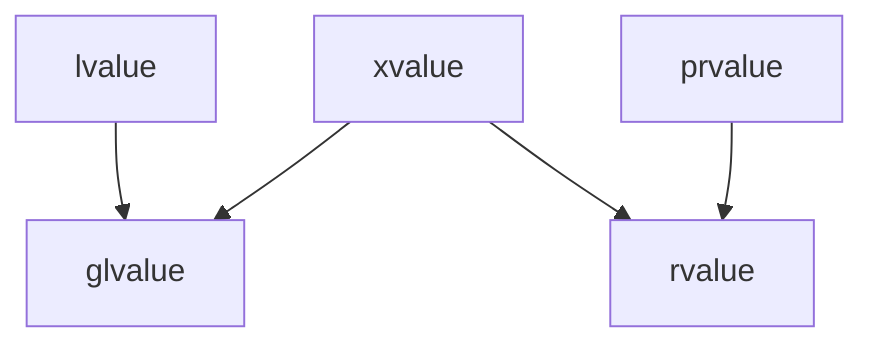

# Expired values. Copy elision. Return value optimization

## Пример с перегрузкой по универсалньой ссылке

Вот есть такой код

```c++
template <typename T>
class Optional {
public:
    Optional() = default;

    Optional(const Optional&) {
        std::cout << "A" << std::endl;
    }

    template <typename U>
    Optional(Optional<U>&&) {
        std::cout << "B" << std::endl;
    }

    template <typename U>
    Optional(U&&) {
        std::cout << "C" << std::endl;
    }
};

int main() {
    Optional<int> a;
    Optional<int> b(a); // C
}
```

- Почему А может быть? Мы передаем lvalue, и логично взять это

- Почему B может быть? Мы берем универсальную ссылку по опшионалу, ну точная подставноку лучше чем приведение типов, но он не может так сделать, потому что это rvalue.

- Почему С может быть? Тут просто унивесальная ссылка от какого типа U. Тут также тут точное подстановка в отличие от А где еще накидывается const

Правильный ответ **С**

А что будет, если в В сделать одну амперсанду то будет В, так как частное препотчтителней чем общее.

## Функция std::exchange

Заменяет значение *obj* c *new_value* и возвращает *obj*

```c++
template <typename T, typename U = T>
constexpr
T exchange(T& obj, U&& new_value) {
    T old_value = std::move(obj);
    obj = std::forward<U>(new_value);
    return old_value;
}
```

## move_iterator

Это адаптер над итератором, только разыименование дает rvalue ссылку, а не lvalue ссылку.

## Понятие glvalue, prvalue, xvalue, новая интуиция насчет lvalue / rvalue



xvalue переводиться как expired value, что из rvalue xvalue а что prvalue?

*xvalue*
1) function call, cast expresion if rvalye retunrs
2)...->x, <>.x
3) есть еще, но уже должно понятно быть

Зачем кстати вообще это штука придумана? Для copy elision

Сколько конструкторов будет вызвано? всего 1, потому что будет copy elision

```c++
string s = string("abc");
```

Стандарт говорит, что если объект будет инцилизироваться prvalue, то она не будет создана, но если бы здесь было std::move(...), то она была xvalue, то копия была бы создана.

since c++17 компилятор обязан не создавать промежуточной строки.

```c++
string f() {
    return string("abs");
}
```

Здесь сразу создается строка на месте где нужно

Рассмотрим такой пример

```c++
struct S {
    int x = 0;
    S(int x) : x(x) {
        std::cout << "created" << std::endl;
    }
    
    S(S&& x): x(x.x) {
        std::cout << "MOVE" << std::endl;
    }

    ~S() {
        std::cout << "Destroyed" << std::endl;
    }

};

int main() {
    S s = S(0); // Created + Destroy
    S ss = S(S(S(S(S(S(S(S(1)))))))); // Created + Destroy
    int x = S(0).x; // prvalue -> xvalue created + Destroy
}
```

## Понятие tempory materiallization

Есть такое понятие в стандарте, которое говорит, что есть случае **неявное преобразование из prvalue в xvalue**

и вот к примеру если мы мувнем элменты выше
```std::move(S(S(S(S(S(1))))))``` то тогда у нас будет создан еще один элемент промежуточный.

На cpp-reference можно посмотреть список то что является этой вещью


```c++
struct T {
    T(S) {}
};

T t = S(S(S(S(S(S(1))))));
// создаться один раз S а потом вызовется конструктор
```

## как понимать lvalue-to-rvalue conversion

Что это такое? Тут говорим об неявной конверции. Компилятор умеет конвертировать glvalue ot prvalue. Неформально это чтение из памяти. Типо есть что-то в памяти а есть регисторы в процеессоре.

## RVO (return value optimization)

Вот здесь будет вызван всего один раз конструктор

```c++
std::string f() {
    std::string str = "ABC";
    return str; // NRVO
}
```

## Надо ли писать std::move после return

```c++
S f(S a) {
    return a; // здесь будет move конструктор
}
```

А когде же нужно писать

```c++
S f(S&& a) {
    return std::move(a);
}
```

Если у нас не RVO то мув иначе копия